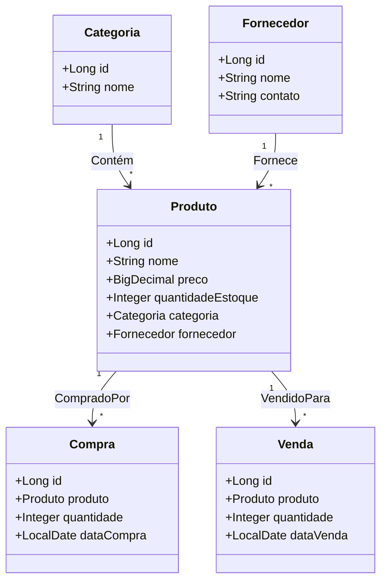

# API de Controle de Estoque e Vendas

## Descrição

Esta é uma API RESTful desenvolvida em Spring Boot para gerenciamento de estoque e vendas de produtos. Ela permite controlar o cadastro de produtos, fornecedores, categorias, além de registrar compras e vendas, com atualização automática de estoque.

## Funcionalidades

- **Cadastro de Produtos:** Criação, leitura, atualização e exclusão de produtos.
- **Cadastro de Categorias:** Organização de produtos por categorias.
- **Cadastro de Fornecedores:** Gerenciamento dos fornecedores dos produtos.
- **Registro de Compras:** Entrada de produtos no estoque por meio de compras.
- **Registro de Vendas:** Saída de produtos do estoque por meio de vendas.
- **Relatórios:** Geração de relatórios sobre vendas e estoque.
- **Autenticação:** Sistema de autenticação para usuários.

##Diagrama de Relacionamento de Entidades(Mermaid):


## Tecnologias Utilizadas

- **Java 21**
- **Spring Boot**
- **Spring Data JPA**
- **Spring Security**
- **Hibernate**
- **H2 Database (para testes)**
- **MySQL ou PostgreSQL (para produção)**
- **Lombok**
- **Maven**

## Endpoints

### Produtos

- `GET /produtos` : Lista todos os produtos.
- `GET /produtos/{id}` : Retorna detalhes de um produto específico.
- `POST /produtos` : Cria um novo produto.
- `PUT /produtos/{id}` : Atualiza um produto existente.
- `DELETE /produtos/{id}` : Remove um produto.

### Categorias

- `GET /categorias` : Lista todas as categorias.
- `POST /categorias` : Cria uma nova categoria.

### Fornecedores

- `GET /fornecedores` : Lista todos os fornecedores.
- `POST /fornecedores` : Cria um novo fornecedor.

### Compras

- `POST /compras` : Registra a compra de um produto.

### Vendas

- `POST /vendas` : Registra a venda de um produto.

## Instalação e Execução

1. Clone o repositório:
   ```bash
   git clone https://github.com/seu-usuario/ControleVendasEestoque.git
   ```

2. Navegue até o diretório do projeto:
   ```bash
   cd ControleVendasEestoque
   ```

3. Configure o banco de dados no arquivo application.properties:
   ```properties
   spring.datasource.url=jdbc:mysql://localhost:3306/estoque_vendas
   spring.datasource.username=usuario
   spring.datasource.password=senha
   spring.jpa.hibernate.ddl-auto=update
   ```

4. Compile e execute a aplicação:
   ```bash
   mvn spring-boot:run
   ```

5. Acesse a API via http://localhost:8080.

# Segurança

A API possui autenticação via Spring Security. É possível configurar diferentes perfis de usuário, como operadores e administradores, com diferentes níveis de acesso.

# Contribuição

Pull requests são bem-vindos. Para mudanças importantes, abra uma issue primeiro para discutir o que você gostaria de mudar.
